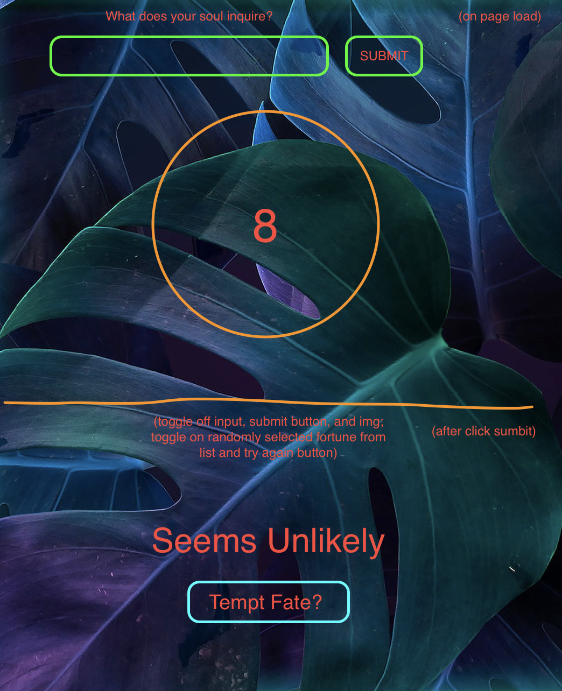

## The Golden Rule:

🦸 🦸‍♂️ `Stop starting and start finishing.` 🏁

If you work on more than one feature at a time, you are guaranteed to multiply your bugs and your anxiety.

## HTML Elements

-   text input for user question
-   submit button to generate the fortune (add event listener)
-   div containing the 8 ball image
-   div to display the random fortune, set the text content

## State Variables

-   selectedFortune

## Events

1 click submit button
_ pick a random fortune
_ remove the input, submit button, and 8 ball img
_ display the fortune p
_ display a try again button

2 click tempt fate button
_ display the input, submit button, and 8 ball img
_ remove the fortune div and tempt fate button

## Fun Stuff/Stretch

-   animate 8 ball on click
-   have a generic message in the input

*   do some spooky background styling
